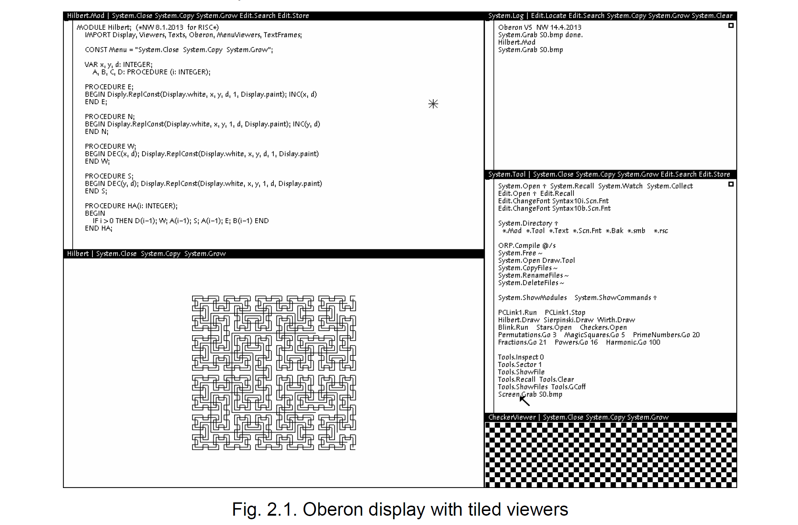

## 2 Basic concepts and structure of the system

### 2.1. Introduction

In order to warrant the sizeable effort of designing and constructing an entire operating system from scratch, a number of basic concepts need to be novel. We start this chapter with a discussion of the principal concepts underlying the Oberon System and of the dominant design decisions. On this basis, a presentation of the system's structure follows. It will be restricted to its coarsest level, namely the composition and interdependence of the largest building blocks, the modules. The chapter ends with an overview of the remainder of the book. It should help the reader to understand the role, place, and significance of the parts described in the individual chapters.

為了保證設計和構建整個操作系統的巨大努力scratch，一些基本概念需要新穎。我們在本章開始討論Oberon 系統的主要概念和主要設計決策。在這個基礎上，系統結構介紹如下。它將被限制在最粗糙的水平，即最大構建塊模塊的組成和相互依賴性。這本章以對本書其餘部分的概述結束。它應該有助於讀者理解各個章節中描述的部分的作用、位置和意義。

The fundamental objective of an operating system is to present the computer to the user and to the programmer at a certain level of abstraction. For example, the store is presented in terms of requestable pieces or variables of a specified data type, the disk is presented in terms of sequences of characters (or bytes) called files, the display is presented as rectangular areas called viewers, the keyboard is presented as an input stream of characters, and the mouse appears as a pair of coordinates and a set of key states. Every abstraction is characterized by certain properties and governed by a set of operations. It is the task of the system to implement these operations and to manage them, constrained by the available resources of the underlying computer. This is commonly called resource management.

操作系統的基本目標是將計算機呈現給用戶和某種抽象層次上的程序員。例如，商店以以下方式呈現指定數據類型的可請求片段或變量，磁盤以字符（或字節）序列稱為文件，顯示呈現為矩形區域稱為對於查看器，鍵盤顯示為字符輸入流，鼠標顯示為一對坐標和一組關鍵狀態。每個抽象都具有某些屬性並由一組操作管理。執行這些操作是系統的任務，並且管理它們，受底層計算機可用資源的限制。這是通常稱為資源管理。

Every abstraction inherently hides details, namely those from which it abstracts. Hiding may occur at different levels. For example, the computer may allow certain parts of the store, or certain devices to be made inaccessible according to its mode of operation (user/supervisor mode), or the programming language may make certain parts inaccessible through a hiding facility inherent in its visibility rules. The latter is of course much more flexible and powerful, and the former indeed plays an almost negligible role in our system. Hiding is important because it allows maintenance of certain properties (called invariants) of an abstraction to be guaranteed. Abstraction is indeed the key of any modularization, and without modularization every hope of being able to guarantee reliability and correctness vanishes. Clearly, the Oberon System was designed with the goal of establishing a modular structure on the basis of purpose-oriented abstractions. The availability of an appropriate programming language is an indispensable prerequisite, and the importance of its choice cannot be over-emphasized.

每個抽象本質上都隱藏了細節，即它從中抽象出來的細節。隱藏可能發生在不同的層面。例如，計算機可能允許商店的某些部分，或某些根據其操作模式（用戶/管理員模式）或編程語言可能通過其固有的隱藏設施使某些部分不可訪問可見性規則。後者當然更加靈活和強大，前者確實可以玩在我們的系統中幾乎可以忽略不計。隱藏很重要，因為它允許維護要保證的抽象的某些屬性（稱為不變量）。抽象確實是任何模塊化的關鍵，沒有模塊化的每一個希望都能夠保證可靠性和正確性消失了。顯然，Oberon 系統的設計目標是在面向目的的抽象的基礎上建立模塊化結構。的可用性合適的編程語言是必不可少的先決條件，其重要性選擇不能過分強調。

### 2.2. Concepts

#### 2.2.1. Viewers

Whereas the abstractions of individual variables representing parts of the primary store, and of files representing  parts  of  the  disk  store  are  well  established  notions  and  have  significance  in  every  computer  system,  abstractions  regarding  input  and  output  devices  became  important  with  the  advent of high interactivity between user and computer. High interactivity requires high bandwidth, and the only channel of human users with high bandwidth is the eye. Consequently, the computer's visual output unit must be properly matched with the human eye. This occurred with the advent of the  high-resolution  display  in  the  mid 1970s,  which  in  turn had  become  feasible  due  to  faster  and  cheaper  electronic  memory  components.  The  high-resolution  display  marked  one  of  the  few  very  significant  break-throughs  in  the  history  of  computer  development.  The  typical  bandwidth  of  a  modern display is in the order of 100 MHz. Primarily the high-resolution display made visual output a subject of abstraction and resource management. In the Oberon System, the display is partitioned into  viewers,  also  called  windows,  or  more  precisely,  into  frames,  rectangular  areas  of  the  screen(s).  A  viewer  typically  consists  of  two  frames,  a  title  bar  containing  a  subject  name  and  a  menu  of  commands,  and  a  main  frame  containing  some  text,  graphic,  picture,  or  other  object.  A  viewer itself is a frame; frames can be nested, in principle to any depth. 

而代表主要存儲部分和文件的各個變量的抽象表示磁盤存儲的部分是公認的概念並且在每個方面都具有重要意義計算機系統，關於輸入和輸出設備的抽象變得重要用戶和計算機之間的高交互性的出現。高交互性需要高帶寬，人類用戶唯一具有高帶寬的渠道是眼睛。因此，計算機的視覺輸出單元必須與人眼正確匹配。這發生在20 世紀 70 年代中期的高分辨率顯示器，由於速度更快、速度更快而變得可行更便宜的電子存儲元件。高分辨率顯示器是為數不多的顯示器之一計算機發展史上的重大突破。的典型帶寬現代顯示器的頻率約為 100 MHz。主要是高分辨率顯示器做視覺輸出抽象和資源管理的主題。在 Oberon 系統中，顯示器是分區的進入觀眾，也稱為窗口，或更準確地說，進入框架，屏幕。查看器通常由兩個框架組成，一個包含主題名稱的標題欄和一個命令菜單，以及包含一些文本、圖形、圖片或其他對象的主框架。一種查看器本身就是一個框架；框架可以嵌套，原則上可以嵌套到任意深度。

The  System  provides  routines  for  generating  a  frame  (viewer),  for  moving  and  for  closing  it.  It  allocates  a  new  viewer  at  a  specified  place,  and  upon  request  delivers  hints  as  to  where  it  might  best  be  placed.  It  keeps  track  of  the  set  of  opened  viewers.  This  is  what  is  called  viewer management, in contrast to the handling of their displayed contents. 

該系統提供用於生成框架（查看器）、移動和關閉框架的例程。它在指定位置分配一個新的查看器，並根據請求提供有關它可能在哪裡的提示最好放置。它跟踪打開的查看器集。這就是所謂的查看器管理，而不是處理它們顯示的內容。

But high interactivity requires not only a high bandwidth for visual output, it demands also flexibility of  input.  Surely,  there  is  no  need  for  an  equally  large  bandwidth,  but  a  keyboard  limited  by  the  speed of typing to about 100 Hz is not good enough. The break-through on this front was achieved by  the  so-called  mouse,  a  pointing  device  which  appeared  roughly  at  the  same  time  as  the  high-resolution display.

但高交互性不僅需要用於視覺輸出的高帶寬，還需要靈活性輸入。當然，不需要同樣大的帶寬，但鍵盤受限於大約 100 Hz 的打字速度不夠好。實現了這方面的突破所謂的鼠標，一種指點設備，大致與高端設備同時出現分辨率顯示。

This  was  by  no  means  just  a  lucky  coincidence.  The  mouse  comes  to  fruition  only  through  appropriate  software  and  the  high-resolution  display.  It  is  itself  a  conceptually  very  simple  device  delivering  signals  when  moved  on  the  table.  These  signals  allow  the  computer  to  update  the  position of a mark - the cursor - on the display. Since feedback occurs through the human eye, no great precision is required from the mouse. For example, when the user wishes to identify a certain object on the screen, such as a letter, he moves the mouse as long as required until the mapped cursor reaches the object. This stands in marked contrast to a digitizer which is supposed to deliver exact coordinates. The Oberon System relies very much on the availability of a mouse. 

這絕不只是一個幸運的巧合。鼠標只有通過適當的軟件和高分辨率顯示器。它本身就是一個概念上非常簡單的設備在桌子上移動時傳遞信號。這些信號允許計算機更新標記（光標）在顯示屏上的位置。由於反饋是通過人眼發生的，所以不鼠標需要很高的精度。例如，當用戶希望識別某個屏幕上的物體，比如一個字母，他只要移動鼠標，直到映射到光標到達對象。這與應該提供的數字化儀形成鮮明對比精確坐標。 Oberon 系統非常依賴鼠標的可用性。

Perhaps the cleverest idea was to equip mice with buttons. By being able to signal a request with the same hand that determines the cursor position, the user obtains the direct impression of issuing position-dependent requests. Position-dependence is realized in software by delegating interpretation of the signal to a procedure - a so-called handler or interpreter -which is local to the viewer in whose area the cursor momentarily appears. A surprising flexibility of command activation can be achieved in this manner by appropriate software. Various techniques have emerged in this connection, e.g. pop-up menus, pull-down-menus, etc. which are powerful even under the presence of  a  single  button  only.  For  many  applications,  a  mouse  with  several  keys  is far  superior, and  the  Oberon  System  basically  assumes  three  buttons  to  be  available.  The  assignment  of  different  functions  to  the  keys  may  of  course  easily  lead  to  confusion  when  every  application  prescribes  different  key  assignment.  This  is,  however,  easily  avoided  by  the  adherence  to  certain  "global"  conventions. In the Oberon System, the left button is primarily used for marking a position (setting a caret),  the  middle  button  for  issuing  general  commands  (see  below),  and  the  right  button  for  selecting displayed objects.

也許最聰明的想法是為鼠標配備按鈕。通過能夠發出請求信號確定光標位置的同一隻手，用戶獲得發布的直接印象位置相關的請求。位置依賴是通過委託在軟件中實現的將信號解釋為過程 - 所謂的處理程序或解釋器 - 它是本地的光標瞬間出現在其區域中的查看器。命令激活的驚人靈活性可以通過適當的軟件以這種方式實現。在這方面出現了各種技術連接，例如彈出式菜單、下拉菜單等，即使在現場也很強大只有一個按鈕。對於許多應用程序，具有多個鍵的鼠標要好得多，而且Oberon System 基本上假定三個按鈕可用。賦值不同當每個應用程序規定時，鍵的功能當然很容易導致混淆不同的鍵分配。然而，這很容易通過堅持某些“全球”慣例。在 Oberon 系統中，左側按鈕主要用於標記位置（設置插入符號），用於發出通用命令的中間按鈕（見下文），以及用於選擇顯示的對象。

Recently, it has become fashionable to use overlapping windows mirroring documents being piled up  on  one's desk.  We  have  found  this  metaphor  not  entirely  convincing.  Partially  hidden  windows  are  typically  brought  to  the  top  and  made  fully  visible  before  any  operation  is  applied  to  their  contents.  In  contrast  to  the  insignificant  advantage  stands  the  substantial  effort  necessary  to  implement  this  scheme.  It  is  a  good  example  of  a  case  where  the  benefit  of  a  complication  is  incommensurate with its cost. Therefore, we have chosen a solution that is much simpler to realize, yet  has  no  genuine  disadvantages  compared  to  overlapping  windows:  tiled  viewers  as  shown  in  Fig. 2.1.

最近流行用重疊窗口鏡像文件堆積在一個人的辦公桌上。我們發現這個比喻並不完全令人信服。部分隱藏的窗口通常會被帶到頂部並在對其應用任何操作之前完全可見內容。與微不足道的優勢相反，需要付出巨大的努力實施該方案。這是一個很好的例子，說明並發症的好處是與其成本不相稱。因此，我們選擇了一個更容易實現的解決方案，但與重疊窗口相比沒有真正的缺點：平鋪查看器，如圖 2.1所示。

#### 2.2.2. Commands

Position-dependent commands with fixed meaning (fixed for each type of viewer) must be supplemented  by  general  commands.  Conventionally,  such  commands  are  issued  through  the  keyboard by typing the program's name that is to be executed into a special command text. In this respect,  the  Oberon  System  offers  a  novel  and  much  more  flexible  solution  which  is  presented  in  the following paragraphs. 

具有固定含義的位置相關命令（對於每種類型的查看器viewer都是固定的）必須是以一般命令為補充。按照慣例，此類命令是通過通過將要執行的程序名稱鍵入特殊命令文本來使用鍵盤。在這個在這方面，Oberon 系統提供了一種新穎且更加靈活的解決方案，該解決方案在以下段落。

First of all we remark that a program in the common sense of a text compiled as a unit is mostly a far too large unit of action to serve as a command. Compare it, for example, with the insertion of a piece of text through a mouse command. In Oberon, the notion of a unit of action is separated from the notion of unit of compilation. The former is a command represented by a (exported) procedure, the  latter  is  a  module.  Hence,  a  module  may,  and  typically  does,  define  several,  even  many  commands. Such a (general) command may be invoked at any time by pointing at its name in any text  visible  in  any  viewer  on  the  display,  and  by  clicking  the  middle  mouse  button.  The  command  name has the form M.P, where P is the procedure's identifier and M that of the module in which P is declared. As a consequence, any command click may cause the loading of one or several modules, if M is not already present in main store. The next invocation of M.P occurs instantaneously, since M  is  already  loaded.  A  further  consequence  is  that  modules  are  never  (automatically)  removed,  because a next command may well refer to the same module.

首先，我們要指出的是，作為一個單元編譯的文本常識中的程序主要是一個太大的行動單位無法作為命令。比較一下，例如，插入一個通過鼠標命令的一段文本。在 Oberon 中，行動單元的概念與編譯單元的概念。前者是由（導出的）過程表示的命令，後者是一個模塊。因此，一個模塊可以而且通常確實定義了幾個，甚至很多命令。這樣的（通用）命令可以在任何時候通過指向它的名稱在任何時候被調用文本在顯示器上的任何查看器中可見，並通過單擊鼠標中鍵。命令名稱的格式為 M.P，其中 P 是過程的標識符，M 是模塊的標識符，其中 P宣布。因此，任何命令點擊都可能導致加載一個或多個模塊，如果 M 還沒有出現在 main store 中。 M.P 的下一次調用瞬間發生，因為M 已經加載。進一步的結果是模塊永遠不會（自動）刪除，因為下一個命令很可能引用同一個模塊。

Every command has the purpose to alter the state of some operands. Typically, they are denoted by text following the command identification, and Oberon follows this convention. Strictly speaking, commands  are  denoted  as  parameterless  procedures;  but  the  system  provides  a  way  for  the  procedure to identify the text position of its origin, and hence to read and interpret the text following the  command,  i.e.  the  actual  parameters.  Both  reading  and  interpretation  must,  however,  be  programmed explicitly.

每個命令都有改變某些操作數狀態的目的。 通常，它們表示為通過命令標識後的文本，Oberon 遵循此約定。 嚴格來講，命令被表示為無參數過程； 但系統提供了一種方法程序識別其來源的文本位置，從而閱讀和解釋以下文本命令，即實際參數。 然而，閱讀和解釋都必須是明確編程。

The parameter text must refer to objects that exist before command execution starts and are quite likely the result of a previous command interpretation. In most operating systems, these objects are files registered in the directory, and they act as interfaces between commands. The Oberon System broadens  this  notion;  the  links  between  consecutive  commands  are  not  restricted  to  files,  but  can  be any global variable, because modules do not disappear from storage after command termination, as mentioned above. 

參數文本必須引用命令執行開始之前存在的對象，並且相當可能是先前命令解釋的結果。 在大多數操作系統中，這些對象是目錄中註冊的文件，它們充當命令之間的接口。 Oberon系統拓寬了這個概念； 連續命令之間的鏈接不限於文件，但可以是任何全局變量，因為模塊不會在命令後從存儲中消失終止，如上所述。

This  tremendous  flexibility  seems  to  open  Pandora's  box,  and  indeed  it  does  when  misused.  The  reason is that global variables' states may completely determine and alter the effect of a command. The  variables  represent  hidden states,  hidden  in  the  sense  that  the  user  is  in general  unaware  of  them and has no easy way to determine their value. The positive aspect of using global variables as  interfaces  between  commands  is  that  some  of  them  may  well  be  visible  on  the  display.  All  viewers  -  and  with  them  also  their  contents  -  are  organized  in  a  data  structure  that  is  rooted  in  a  global variable (in module Viewers). Parts of this variable therefore constitute visible states, and it is highly appropriate to refer to them as command parameters. 

這種巨大的靈活性似乎打開了潘多拉魔盒，如果使用不當，確實如此。 這原因是全局變量的狀態可能完全決定和改變命令的效果。變量表示隱藏狀態，隱藏在用戶通常不知道的意義上他們並沒有簡單的方法來確定他們的價值。 使用全局變量的積極方面作為命令之間的接口，其中一些很可能在顯示器上可見。 全部查看器——以及它們的內容——被組織在一個數據結構中，該結構植根於全局變量（在模塊 Viewers 中）。 因此，這個變量的一部分構成可見狀態，並且它是將它們稱為命令參數非常合適。

One of the rules of what may be called the Oberon Programming Style is therefore to avoid hidden states, and to reduce the introduction of global variables. We do not, however, raise this rule to the rank  of  a  dogma.  There  exist  genuinely  useful  exceptions,  even  if  the  variables  have  no  visible  parts.

因此，所謂的 Oberon 編程風格的規則之一是避免隱藏狀態，減少全局變量的引入。 但是，我們不會將此規則提高到教條的等級。 存在真正有用的例外，即使變量沒有可見的部分。

There remains the question of how to denote visible objects as command parameters. An obvious case is the use of the most recent selection as parameter. A procedure for locating that selection is provided by module Oberon. (It is restricted to text selections).  Another possibility is the use of the caret position in a text. This is used in the case of inserting new text; the pressing of a key on the keyboard is also considered to be a command, and it causes the character's insertion at the caret position. 

仍然存在如何將可見對象表示為命令參數的問題。 一個明顯的例子是使用最近的選擇作為參數。 用於定位該選擇的過程由模塊 Oberon 提供。 （僅限於文本選擇）。 另一種可能性是在文本中使用插入符位置。 這用於插入新文本的情況； 在鍵盤上按下一個鍵也被認為是一個命令，它會導致字符插入到插入符號位置。

A special facility is introduced for designating viewers as operands: the star marker. It is placed at the cursor position when the keyboard's mark key (SETUP) is pressed. The procedure Oberon.MarkedViewer identifies the viewer in whose area the star lies. Commands which take it as their parameter are typically followed by an asterisk in the text. Whether the text contained in a text viewer, or a graph contained in a graphic viewer, or any other part of the marked viewer is taken as the actual parameter depends on how the command procedure is programmed. 

引入了一種特殊設施，用於將觀眾指定為操作對象：星標。 當按下鍵盤的標記鍵 (SETUP) 時，它位於光標位置。 過程 Oberon.MarkedViewer 識別星星所在區域的觀察者。 將它作為參數的命令通常在文本中後跟一個星號。 文本查看器中包含的文本，圖形查看器中包含的圖形，或標記查看器的任何其他部分是否被視為實際參數取決於命令過程的編程方式。

Finally,  a  most  welcome  property  of  the  system  should  not  remain  unmentioned.  It  is  a  direct  consequence of the persistent nature of global variables and becomes manifest when a command fails. Detected failures result in a trap. Such a trap should be regarded as an abnormal command termination. In the worst case, global data may be left in an inconsistent state, but they are not lost, and a next command can be initiated based on their current state. A trap opens a small viewer and lists  the  sequence  of  invoked  procedures  with  their  local  variables  and  current  values.  This  information helps a programmer to identify the cause of the trap.

最後，系統的一個最受歡迎的特性不應被提及。 它是全局變量持久性的直接結果，並在命令失敗時變得明顯。 檢測到的故障會導致陷阱。 這樣的陷阱應該被視為命令異常終止。 在最壞的情況下，全局數據可能處於不一致的狀態，但它們並沒有丟失，並且可以根據它們的當前狀態啟動下一個命令。 陷阱打開一個小查看器並列出調用過程的序列及其局部變量和當前值。 此信息有助於程序員識別陷阱的原因。

#### 2.2.3. Tasks 

From the presentations above it follows that the Oberon System is distinguished by a highly flexible scheme  of  command  activation.  The  notion  of  a  command  extends  from  the  insertion  of  a  single  character and the setting of a marker to computations that may take hours or days. It is moreover distinguished  by  a  highly  flexible  notion  of  operand  selection  not  restricted  to  registered,  named  files.  And  most  importantly,  by  the  virtual  absence  of  hidden  states.  The  state  of  the  system  is  practically determined by what is visible to the user. 

從上面的介紹可以看出，Oberon 系統以高度靈活的命令激活方案而著稱。 命令的概念從單個字符的插入和標記的設置擴展到可能需要數小時或數天的計算。 此外，它的特點是高度靈活的操作數選擇概念，不限於已註冊的命名文件。 最重要的是，實際上沒有隱藏狀態。 系統的狀態實際上由用戶可見的內容決定。

This  makes  it  unnecessary  to  remember  a  long  history  of  previously  activated commands, started  programs,  entered  modes,  etc.  Modes  are  in  our  view  the  hallmark  of  user-unfriendly  systems.  It  should at this point have become obvious that the system allows a user to pursue several different tasks  concurrently.  They  are  manifest  in  the  form  of  viewers  containing  texts,  graphics,  or  other  displayable objects. The user switches between tasks implicitly when choosing a different viewer as operand  for  the  next  command.  The  characteristic  of  this  concept  is  that  task  switching  is  under  explicit control of the user, and the atomic units of action are the commands. 

這使得不必記住以前激活的命令、啟動的程序、進入的模式等的長期歷史記錄。在我們看來，模式是用戶不友好系統的標誌。 在這一點上，系統允許用戶同時執行多個不同的任務應該已經很明顯了。 它們以包含文本、圖形或其他可顯示對象的查看器的形式出現。 當選擇不同的查看器作為下一個命令的操作對象時，用戶會隱式地在任務之間切換。 這個概念的特點是任務切換在用戶的明確控制下，而原子操作單元是命令。

At  the  same  time,  we  classify  Oberon  as  a  single-process  (or  single-thread)  system.  How  is  this  apparent paradox to be understood?  Perhaps it is best explained by considering the basic mode of operation. Unless engaged in the interpretation of a command, the processor is engaged in a loop continuously  polling  event  sources.  This  loop  is  called  the  central  loop;  it  is  contained  in  module  Oberon which may be regarded as the system's heart. The two fixed event sources are the mouse and the keyboard. If a keyboard event is sensed, control is dispatched to the handler installed in the so-called focus viewer, designated as the one holding the caret. If a mouse event (key) is sensed, control is dispatched to the handler in which the cursor currently lies. This is all possible under the paradigm of a single, uninterruptible process.

同時，我們將 Oberon 歸類為單進程（或單線程）系統。 如何理解這個明顯的悖論？ 也許最好通過考慮基本操作模式來解釋。 除非參與命令的解釋，否則處理器將參與一個循環，不斷輪詢事件源。 這個循環稱為中央循環； 它包含在模塊 Oberon 中，可以被視為系統的核心。 兩個固定的事件源是鼠標和鍵盤。 如果檢測到鍵盤事件，控制將被分派到安裝在所謂的焦點查看器中的處理程序，指定為持有插入符的那個。 如果感測到鼠標事件（鍵），則將控制分派給光標當前所在的處理程序。 在單一的、不間斷的進程的範例下，這一切都是可能的。

The  notion  of  a  single  process  implies  non-interruptability,  and  therefore  also  that  commands  cannot  interact  with  the  user.  Interaction  is  confined  to  the  selection  of  commands  before  their  execution. Hence, there exists no input statement in typical Oberon programs. Inputs are given by parameters supplied and designated before command invocation. 

單個進程的概念意味著不可中斷性，因此命令也不能與用戶交互。 交互僅限於在執行之前選擇命令。 因此，典型的 Oberon 程序中不存在輸入語句。 輸入由命令調用前提供和指定的參數給出。

This scheme at first appears as gravely restrictive. In practice it is not, if one considers single-user operation.  It  is  this  single  user  who  carries  out  a  dialog  with  the  computer.  A  human  might  be  capable of  engaging  in  simultaneous  dialogs  with  several processes  only  if  the  commands  issued are very time-consuming. We suggest that execution of time-consuming computations might better be delegated to loosely coupled compute-servers in a distributed system.

該方案乍一看似乎具有嚴格的限制性。 實際上不是，如果考慮單用戶操作。 正是這個單獨的用戶與計算機進行對話。 僅當發出的命令非常耗時時，人類才可能能夠與多個進程同時進行對話。 我們建議將耗時計算的執行委託給分佈式系統中鬆散耦合的計算服務器會更好。

The  primary  advantage  of  a  system  dealing  with  a  single  process  is  that  task  switches  occur  at  user-defined  points  only,  where  no  local  process  state  has  to  be  preserved  until  resumption.  Furthermore, because the switches are user-chosen, the tasks cannot interfere in unexpected and uncontrollable  ways  by  accessing  common  variables.  The  system  designer  can  therefore  omit  all  kinds of protection mechanisms that exclude such interference. This is a significant simplification. 

處理單個進程的系統的主要優點是任務切換僅發生在用戶定義的點，在恢復之前不必保留本地進程狀態。 此外，由於開關是用戶選擇的，因此任務不會通過訪問公共變量以意想不到和無法控制的方式進行干預。 因此，系統設計人員可以省略各種排除此類干擾的保護機制。 這是一個重要的簡化。

The  essential  difference  between  Oberon  and  multiprocess-systems  is  that  in  the  former  task  switches  occur  between commands only,  whereas  in  the  latter  a switch  may  be  invoked  after  any  single  instruction.  Evidently,  the  difference  is  one  of  granularity  of  action.  Oberon's  granularity  is  coarse, which is entirely acceptable for a single-user system. 

Oberon 和多進程系統之間的本質區別在於，在前者中，任務切換僅發生在命令之間，而在後者中，可以在任何單個指令之後調用切換。 顯然，區別在於行動的粒度之一。 Oberon 的粒度比較粗，對於單用戶系統來說完全可以接受。

The  system  offers  the  possibility  to  insert  further  polling  commands  in  the  central  loop.  This  is  necessary  if  additional  event  sources  are  to  be  introduced.  The  prominent  example  is  a  network,  where  commands  may  be  sent  from  other  workstations.  The  central  loop  scans  a  list  of  so-called  task  descriptors.  Each  descriptor  refers  to  a  command  procedure.  The  two  standard  events  are  selected  only  if  their  guard  permits,  i.e.  if  either  keyboard  input  is  present,  or  if  a  mouse  event  occurs. Inserted tasks must provide their own guard in the beginning of the installed procedure.

該系統提供了在中央迴路中插入更多輪詢命令的可能性。 如果要引入額外的事件源，這是必要的。 突出的例子是網絡，其中可以從其他工作站發送命令。 中央循環掃描所謂的任務描述符列表。 每個描述符都指向一個命令過程。 這兩個標準事件只有在它們的守衛允許時才會被選中，即如果鍵盤輸入存在，或者鼠標事件發生。 插入的任務必須在安裝過程的開頭提供自己的守衛。

The example of a network inserting commands, called requests, raises a question: what happens if the  processor  is  engaged  in  the  execution  of  another  command  when  the  request  arrives?  Evidently, the request would be lost unless measures are taken. The problem is easily remedied by buffering the input. This is done in every driver of an input device, in the keyboard driver as well as the  network  driver.  The  incoming  signal  triggers  an  interrupt,  and  the  invoked  interrupt  handler  accepts the input and buffers it. We emphasize that such interrupt handling is confined to drivers, system  components  at  the  lowest  level.  An  interrupt  does  not  evoke  a  task  selection  and  a  task  switch. Control simply returns to the point of interruption, and the interrupt remains unnoticeable to programs. There exists, as with every rule, an exception: an interrupt due to keyboard input of the abort character returns control to the central loop. 

網絡插入命令（稱為請求）的示例提出了一個問題：如果處理器在請求到達時正在執行另一個命令，會發生什麼情況？顯然，除非採取措施，否則請求將丟失。 這個問題很容易通過緩衝輸入來解決。 這是在輸入設備的每個驅動程序中完成的，在鍵盤驅動程序和網絡驅動程序中。 傳入信號觸發中斷，調用的中斷處理程序接受輸入並對其進行緩衝。 我們強調這種中斷處理僅限於最低級別的驅動程序和系統組件。 中斷不會引起任務選擇和任務切換。 控制簡單地返回到中斷點，程序不會注意到中斷。 與每條規則一樣，存在一個例外：由於鍵盤輸入中止字符而導致的中斷將控制權返回到中央循環。

#### 2.2.4. Tool Texts as Configurable Menus

Certainly, the concepts of viewers specifying their own interpretation of mouse clicks, of commands invokable  from  any  text  on  the  display,  of  any  displayed  object  being  selectable  as  an  interface  between  commands,  and  of  commands  being  dialog-free,  uninterruptible  units  of  action,  have  considerable  influence  on  the  style  of  programming  in  Oberon,  and  they  thoroughly  change  the  style  of  using  the  computer.  The  ease  and  flexibility  in  the  way  pieces  of  text  can  be  selected,  moved, copied, and designated as command and as command parameters, drastically reduces the need  for  typing.  The  mouse  becomes  the  dominant  input  device:  the  keyboard  merely  serves  to  input textual data. This is accentuated by the use of so-called tool texts, compositions of frequently used commands, which are typically displayed in the narrower system track of viewers. One simply doesn't type commands! They are usually visible somewhere already. Typically, the user composes a tool text for every project pursued. Tool texts can be regarded as individually configurable private menus.

當然，viewers的概念指定了他們自己對鼠標點擊的解釋，可以從顯示器上的任何文本調用的命令，任何顯示的對像都可以選擇作為命令之間的接口，以及命令是無對話的，不間斷的動作單元，已經 對 Oberon 的編程風格產生了相當大的影響，他們徹底改變了使用計算機的方式。 選擇、移動、複製和指定為命令和命令參數的文本片段的方式的簡便性和靈活性極大地減少了鍵入的需要。 鼠標成為主要的輸入設備：鍵盤僅用於輸入文本數據。 這通過使用所謂的工具文本、常用命令的組合而得到強調，這些文本通常顯示在觀眾的較窄系統軌道中。 一個人根本不輸入命令！ 它們通常已經在某處可見。 通常，用戶會為每個追求的項目撰寫工具文本。 工具文本可視為可單獨配置的私人菜單。

The rarity of issuing commands by typing them has the most agreeable benefit that their names can be meaningful words. For example, the copy operation is denoted by Copy instead of cp, rename by Rename instead of rn, the call for a file directory excerpt is named Directory instead of ls. The need  for  memorizing  an  infinite  list  of  cryptic  abbreviations,  which  is  another  hallmark  of  user-unfriendly systems, vanishes.

通過鍵入命令來發出命令的罕見之處在於它們的名稱可以是有意義的單詞，這是最令人愉快的好處。 例如，複製操作用Copy而不是cp表示，重命名用Rename而不是rn，對文件目錄摘錄的調用是命名為Directory而不是ls。 記住無窮無盡的神秘縮寫列表的需求消失了，這是用戶不友好系統的另一個標誌。

But the influence of the Oberon concept is not restricted to the style in which the computer is used. It  extends  also  to  the  way  programs  are  designed  to  communicate  with  the  environment.  The  definition of the abstract type Text in the system's core suggests the replacement of files by texts as carrier  of  input  and  output  data  in  very many  cases. The  advantage  to be gained  lies  in  the  text's  immediate  editability.  For  example,  the  output  of  the  command  System.Directory  produces  the  desired excerpt of the file directory in the form of a (displayed) text. Parts of it or the whole may be selected and copied into other texts by regular editing commands (mouse clicks). Or, the compiler accepts  texts  as  input.  It  is  therefore  possible  to  compile  a  text,  execute  the  program,  and  to  recompile  the  re-edited  text  without  storing  it  on  disk  between  compilations  and  tests.  The  ubiquitous  editability  of  text  together  with  the  persistence  of  global  data  (in  particular  viewers)  allows many steps that do not contribute to the progress of the task actually pursued to be avoided.

但 Oberon 概念的影響並不僅限於計算機的使用方式。 它還擴展到程序設計與環境通信的方式。 系統核心中抽象類型Text的定義暗示在很多情況下以文本代替文件作為輸入輸出數據的載體。 獲得的優勢在於文本的即時可編輯性。 例如，命令 System.Directory 的輸出以（顯示的）文本形式生成所需的文件目錄摘錄。 可以通過常規編輯命令（單擊鼠標）選擇部分或全部內容並將其複製到其他文本中。 或者，編譯器接受文本作為輸入。 因此，可以編譯文本、執行程序並重新編譯重新編輯的文本，而無需在編譯和測試之間將其存儲在磁盤上。 文本無處不在的可編輯性以及全局數據（特別是查看者）的持久性允許避免許多無助於實際追求的任務進展的步驟。

#### 2.2.5. Extensibility

An  important  objective  in  the  design  of  the  Oberon  System  was  extensibility.  It  should  be  easy  to  extend  the  system  with  new  facilities  by  adding  modules  that  make  use  of  the  already  existing  resources. Equally important, it should also reduce the system to those facilities that are currently and actually used. For example, a document editor processing documents free of graphics should not  require  the  loading  of  an  extensive  graphics  editor,  a  workstation  operating  as  a  stand-alone  system should not require the loading of extensive network software, and a system used for clerical purposes  need  include  neither  compiler  nor  assembler.  Also,  a  system  introducing  a  new  kind  of  display frame should not include procedures for managing viewers containing such frames. Instead, it should make use of existing viewer management. The staggering consumption of memory space by  many  widely  used  systems  is  due  to  violation  of  such  fundamental  rules  of  engineering.  The  requirement  of  many  megabytes  of  store  for  an  operating  system  is,  albeit  commonly  tolerated,  absurd  and  another  hallmark  of  user-unfriendliness,  or  perhaps  manufacturer  friendliness.  Its  reason is none other than inadequate extensibility.

Oberon 系統設計的一個重要目標是可擴展性。 通過添加利用現有資源的模塊，使用新設施擴展系統應該很容易。 同樣重要的是，它還應該將系統簡化為那些當前和實際使用的設施。 例如，處理沒有圖形的文檔的文檔編輯器不需要加載大量的圖形編輯器，作為獨立系統運行的工作站不需要加載大量的網絡軟件，用於文書目的的系統需要包括 既不是編譯器也不是彙編器。 此外，引入新型顯示幀的系統不應包括用於管理包含此類幀的查看器的過程。 相反，它應該利用現有的查看器管理。 許多廣泛使用的系統對內存空間的驚人消耗是由於違反了這些基本的工程規則。 儘管通常可以容忍，但對操作系統的許多兆字節存儲的要求是荒謬的，並且是用戶不友好或製造商友好的另一個標誌。 其原因莫過於擴展性不足。

We  do  not  restrict  this  notion  to  procedural  extensibility,  which  is  easy  to  realize.  The  important  point is that extensions may not only add further procedures and functions, but introduce their own data  types  built  on  the  basis  of  those  provided  by  the  system:  data  extensibility.  For  example,  a  graphics  system  should  be  able  to  define  its  graphics  frames  based  on  frames  provided  by  the  basic display module and by extending them with attributes appropriate for graphics. 

我們不將此概念限制為易於實現的過程可擴展性。 重要的一點是，擴展不僅可以添加更多的過程和功能，而且可以在系統提供的數據類型的基礎上引入自己的數據類型：數據可擴展性。 例如，圖形系統應該能夠根據基本顯示模塊提供的框架定義其圖形框架，並通過使用適合圖形的屬性來擴展它們。

This requires an adequate language feature. The language Oberon provides precisely this facility in the  form  of  type  extensions.  The  language  was  designed  for  this  reason;  Modula-2  would  have  been  the  choice,  had  it  not  been  for  the  lack  of  a  type  extension  feature.  Its  influence  on  system  structure  was  profound,  and  the  results  have  been  most  encouraging.  In  the  meantime,  many  additions have been created with surprising ease. One of them is described at the end of this book. The basic system is nevertheless quite modest in its resource requirements (see Table at the end of Section 2.3).

這需要足夠的語言特性。 Oberon 語言以類型擴展的形式提供了這種便利。 該語言就是出於這個原因而設計的； 如果不是因為缺少類型擴展功能，Modula-2 可能是最佳選擇。 它對系統結構的影響是深遠的，結果是最令人鼓舞的。 與此同時，許多新增功能的創建也出人意料地輕鬆。 其中之一在本書末尾進行了描述。 儘管如此，基本系統的資源需求卻相當有限（見第 2.3 節末尾的表格）。

#### 2.2.6. Dynamic Loading

Activation of commands residing in modules that are not present in the store implies the loading of the  modules  and,  of  course,  all  their  imports.  Invoking  the  loader  is,  however,  not  restricted  to  command  activation;  it  may  also  occur  through  programmed  procedure  calls.  This  facility  is  indispensable  for  a  successful  realization  of  genuine  extensibility.  Modules  must  be  loadable  on  demand.  For  example,  a  document  editor  loads  a  graphics  package  when  a  graphic  element  appears in the processed document, but not otherwise.

激活存儲中不存在的模塊中的命令意味著加載模塊，當然還有它們的所有導入。 然而，調用加載器並不局限於命令激活； 它也可能通過程序調用發生。 此功能對於成功實現真正的可擴展性是不可或缺的。 模塊必須可按需加載。 例如，當圖形元素出現在已處理的文檔中時，文檔編輯器加載圖形包，否則不會。

The  Oberon  System  features  no  separate  linker.  A  module  is  linked  with  its  imports  when  it  is  loaded,  and  never  before.  As  a  consequence,  every  module  is  present  only  once,  in  main  store  (linked) as well as on backing store (unlinked, as file). Avoiding the generation of multiple copies in different, linked object files is the key to storage economy. Prelinked mega-files do not occur in the Oberon System, and every module is freely reusable.

Oberon 系統沒有單獨的鏈接器。 模塊在加載時與其導入鏈接，而之前從未如此。 因此，每個模塊只存在一次，在主存儲（鏈接）和後備存儲（未鏈接，作為文件）中。 避免在不同的、鏈接的目標文件中生成多個副本是存儲經濟的關鍵。 Oberon 系統中不會出現預先鏈接的巨型文件，並且每個模塊都可以自由重複使用。