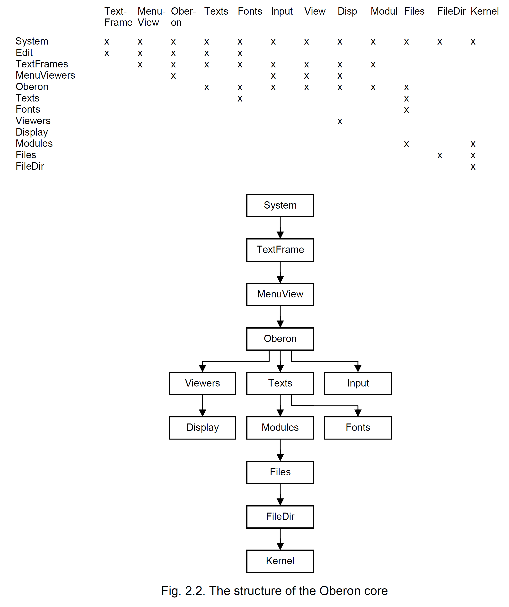

### 2.3. The system's structure

The  largest  identifiable  units  of  the  system  are  its  modules.  It  is  therefore  most  appropriate  to  describe a system's structure in terms of its modules. As their interfaces are explicitly declared, it is also  easy  to  exhibit  their  interdependence  in  the  form  of  a  directed  graph.  The  edges  indicate  imports.

系統最大的可識別單元是它的模塊。 因此，用模塊來描述系統的結構是最合適的。 由於它們的接口是明確聲明的，因此也很容易以有向圖的形式展示它們的相互依賴性。 邊緣表示進口。

The  module  graph  of  a  system  programmed  in  Oberon  is  hierarchical,  i.e.  has  no  cycles.  The lowest members of the hierarchy effectively import hardware only. We refer here to modules which contain  device  drivers.  But module  Kernel  also  belongs  to  this  class;  it  "imports  memory"  and  includes the disk driver. The modules on the top of the hierarchy effectively export to the user. As the user has direct access to command procedures, we call these top members command modules or tool modules.

在 Oberon 中編程的系統模塊圖是分層的，即沒有循環。 層次結構的最低成員僅有效地導入硬件。 我們在這裡指的是包含設備驅動程序的模塊。 但是模塊 Kernel 也屬於這個類； 它“導入內存”並包含磁盤驅動程序。 層次結構頂部的模塊有效地導出給用戶。 由於用戶可以直接訪問命令過程，我們將這些頂級成員稱為命令模塊或工具模塊。

The hierarchy of the basic system is shown in a table of direct imports and as a graph in Figure 2.2. The  picture  is  simplified  by  omitting  direct  import  edges  if  an  indirect  path  also  leads  from  the  source  to  the  destination.  For  example,  Files  imports  Kernel;  the  direct  import  is  not  shown,  because a path from Kernel leads to Files via FileDir.

基本系統的層次結構顯示在直接導入表和圖 2.2 中的圖表中。 如果間接路徑也從源到目的地，則通過省略直接導入邊來簡化圖片。 例如，Files 導入 Kernel； 未顯示直接導入，因為從內核的路徑通過 FileDir 指向文件。

Module  names  in  the  plural  form  typically  indicate  the  definition  of  an  abstract  data  type  in  the  module. The type is exported together with the pertinent operations. Examples are Files, Modules, Fonts, Texts, Viewers, MenuViewers, and TextFrames. Modules whose names are in singular form typically  denote  a  resource  that  the  module  manages,  be  it  a  global  variable  or  a  device.  The  variable or the device is itself hidden (not exported) and becomes accessible through the module's exported  procedures.  Examples  are  all  device  drivers,  Input  for  keyboard  and  mouse,  Kernel  for  memory  and  disk,  and  Display.  Exceptions  are  the  command  modules  whose  name  is  mostly  chosen according to the activity they primarily represent, like System, and Edit

複數形式的模塊名稱通常表示模塊中抽象數據類型的定義。 該類型與相關操作一起導出。 示例包括文件、模塊、字體、文本、查看器、菜單查看器和 TextFrames。 名稱為單數形式的模塊通常表示模塊管理的資源，無論是全局變量還是設備。 變量或設備本身是隱藏的（不導出）並且可以通過模塊的導出過程訪問。 示例是所有設備驅動程序、鍵盤和鼠標的輸入、內存和磁盤的內核以及顯示。 例外是命令模塊，其名稱主要根據它們主要代表的活動來選擇，例如系統和編輯

Module  Oberon  is,  as  already  mentioned,  the  heart  of  the  system  containing  the  central  loop  to  which  control  returns  after  each  command  interpretation,  independent  of  whether  it  terminates  normally  or  abnormally.  Oberon  exports  several  procedures  of  auxiliary  nature,  but  primarily  also  the  one  allowing  the  invocation  of  commands  (Call) and  access  to  the  command's  parameter  text  through variable Oberon.Par. Furthermore, it contains global, exported variables: the log text. The log  text  typically  serves  to  issue  prompts  and  short  failure  reports  of  commands.  The  text  is  displayed  in  a  log  viewer  that  is  automatically  opened  when  module  System  is  initialized.  Module  Oberon furthermore contains the two markers used globally on the display, the mouse cursor and the  star  pointer.  It  exports  procedures  to  draw  and  to  erase  them,  and  allows  the  installation  of  different patterns for them. 

正如已經提到的，模塊 Oberon 是系統的核心，包含中央循環，控制在每個命令解釋後返回，無論它是正常終止還是異常終止。 Oberon 導出幾個輔助性質的過程，但主要也是允許調用命令 (Call) 和通過變量 Oberon.Par 訪問命令的參數文本的過程。 此外，它還包含全局的、導出的變量：日誌文本。 日誌文本通常用於發出提示和簡短的命令失敗報告。 文本顯示在日誌查看器中，該查看器在初始化模塊系統時自動打開。 Module Oberon 還包含顯示器上全局使用的兩個標記，即鼠標光標和星形指針。 它導出繪製和擦除它們的程序，並允許為它們安裝不同的圖案。

The system shown in Fig. 2.2. basically contains facilities for generating and editing texts, and for storing them in the file system. All other functions are performed by modules that must be added in the  usual  way  by  module  loading  on  demand.  This  includes,  notably,  the  compiler,  network  communication,  document  editors,  and  all  sorts  of  programs  designed  by  users.  The  high  priority  given in the system's conception to modularity, to avoiding unnecessary frills, and to concentrate on the indispensable in the core, has resulted in a system of remarkable compactness. Although this property  may  be  regarded  as  of  little  importance  in  this  era  of  falling  costs  of large  memories,  we  consider  it  to  be  highly  essential.  We  merely  should  like  to  draw  the  reader's  attention  to  the  correlation  between  a  systems'  size  and  its  reliability.  Also,  we  do  not  consider  it  as  good  engineering  practice  to  consume  a  resource  lavishly  just  because  it  happens  to  be  cheap.  The  following table lists the core's modules and the major application modules, and it indicates the size of code (in words) and static variables (in bytes) and, the number of source program lines.

該系統如圖 2.2 所示。基本上包含用於生成和編輯文本以及將它們存儲在文件系統中的工具。所有其他功能都由模塊執行，這些模塊必須通過按需加載模塊以通常的方式添加。這尤其包括編譯器、網絡通信、文檔編輯器以及用戶設計的各種程序。該系統的概念高度重視模塊化，避免不必要的裝飾，並專注於核心不可或缺的部分，從而形成了一個非常緊湊的系統。雖然在這個大內存成本下降的時代，這個屬性可能被認為不那麼重要，但我們認為它是非常重要的。我們只想提請讀者注意系統規模與其可靠性之間的相關性。此外，我們並不認為僅僅因為資源便宜就大量消耗資源是良好的工程實踐。下表列出了內核的模塊和主要的應用模塊，並指出了代碼（以字為單位）和靜態變量（以字節為單位）的大小以及源程序行數。

### 2.4. A tour through the chapters

Implementation of a system proceeds bottom-up. Naturally, because modules on higher levels are clients  of  those  on  the  lower  levels  and  cannot  function  without  the  availability  of  their  imports.  Description  of  a  system,  on  the  other  hand,  is  better  ordered  in  the  top-down  direction.  This  is  because a system is designed with its expected applications and functions in mind. Decomposition into  a  hierarchy  of  modules  is  justified  by  the  use  of  auxiliary  functions  and  abstractions  and  by  postponing their more detailed explanation to a later time when their need has been fully motivated. For this reason, we will proceed essentially in the top-down direction.

系統的實施是自下而上進行的。 自然地，因為較高級別的模塊是較低級別的模塊的客戶，並且沒有它們的導入可用性就無法運行。 另一方面，系統的描述最好按自上而下的方向排列。 這是因為系統在設計時考慮了其預期的應用程序和功能。 通過使用輔助功能和抽象以及將它們的更詳細解釋推遲到它們的需求被充分激發時的稍後時間來證明分解為模塊層次結構是合理的。 因此，我們將基本上按照自上而下的方向進行。

Chapters 3 - 5 describe the outer core of the system. Chapter 3 focusses on the dynamic aspects. In  particular,  this  chapter  introduces  the  fundamental  operational  units  of  task  and  command. Oberon's  tasking  model  distinguishes  the  categories  of  interactive  tasks  and  background  tasks. Interactive  tasks  are  represented  on  the  display  screen  by  rectangular  areas,  so-called  viewers. Background tasks need not be connected with any displayed object. They are scheduled with low priority when interactions are absent. A good example of a background task is the memory garbage collector. Both interactive tasks and background tasks are mapped to a single process by the task scheduler.  Commands  in  Oberon  are  explicit,  atomic  units  of  interactive  operations.  They  are  realized in the form of exported parameterless procedures and replace the heavier-weight notion of program known from more conventional operating systems. This chapter continues with a definition of a software toolbox as a logically connected collection of commands. It terminates with an outline of the system control toolbox. 

第 3 至 5 章描述了系統的外核。 第 3 章著重於動態方面。 特別是，本章介紹了任務和指揮的基本操作單元。 Oberon 的任務模型區分了交互任務和後台任務的類別。 交互式任務在顯示屏上由矩形區域（即所謂的查看器）表示。 後台任務不需要與任何顯示的對象相關聯。 當交互不存在時，它們被安排為低優先級。 後台任務的一個很好的例子是內存垃圾收集器。 任務調度程序將交互式任務和後台任務映射到單個進程。 Oberon 中的命令是交互操作的顯式原子單元。 它們以導出的無參數過程的形式實現，並取代了更傳統操作系統中已知的重量級程序概念。 本章繼續將軟件工具箱定義為邏輯上連接的命令集合。 它以系統控制工具箱的概要結束。

Chapter 4 explains Oberon's display system. It starts with a discussion of our choice of a hierarchical tiling strategy for the allocation of viewers. A detailed study of the exact role of Oberon viewers follows. Type Viewer is presented as an object class with an open message interface providing a conceptual basis for far-reaching extensibility. Viewers are then recognized as just a special case of so-called frames that may be nested. A category of standard viewers containing a menu frame and a frame of contents is investigated. The next topic is cursor handling. A cursor in Oberon is a marked path. Both viewer manager and cursor handler operate on an abstract logical display area rather than on individual physical monitors. This allows a unified handling of display requests, independent of number and types of monitors assigned. For example, smooth transitions of the cursor across screen boundaries are conceptually guaranteed. The chapter continues with the presentation of a concise and complete set of raster operations that is used to place textual and graphical elements in the display area. An overview of the system display toolbox concludes the chapter.

第 4 章解釋了 Oberon 的顯示系統。 它首先討論我們為觀眾分配選擇的分層平鋪策略。 下面詳細研究 Oberon 觀眾的確切角色。 Type Viewer 以對像類的形式呈現，帶有開放的消息接口，為廣泛的可擴展性提供了概念基礎。 然後將查看器識別為所謂的可以嵌套的框架的特例。 研究了包含菜單框架和內容框架的標準查看器類別。 下一個主題是游標處理。 Oberon 中的游標是標記的路徑。 查看器管理器和光標處理程序都在抽象的邏輯顯示區域而不是在單獨的物理監視器上運行。 這允許統一處理顯示請求，而與分配的監視器的數量和類型無關。 例如，光標跨屏幕邊界的平滑過渡在概念上是有保證的。 本章繼續介紹一組簡潔而完整的光柵操作，用於將文本和圖形元素放置在顯示區域中。 本章最後概述了系統顯示工具箱。

Chapter 5 introduces text. Oberon distinguishes itself by treating Text as an abstract data type that is integrated in the central  system.  Numerous  fundamental  consequences  are  discussed.  For  example, a text can be produced by one command, edited by a user, and then consumed by a next command.  Commands  themselves  can  be  represented  textually  in  the  form  M.P,  followed  by  a  textual  parameter  list.  Consequently,  any  command  can  be  called  directly  from  within  a  text  (so-called  tool)  simply  by  pointing  at  it  with  the  mouse.  However,  the  core  of  this  chapter  is  a  presentation of Oberon's text system as a case study in program modularization. The concerns of managing a text and displaying it are nicely separated. Both the text manager and the text display feature  an  abstract  public  interface  as  well  as  an  internally  hidden  data  structure.  Finally  in  this  chapter, Oberon's type-font management and the toolbox for editing are discussed.

第5章介紹正文。 Oberon 的與眾不同之處在於將文本視為集成在中央系統中的抽象數據類型。 討論了許多基本後果。 例如，文本可以由一個命令生成，由用戶編輯，然後由下一個命令使用。 命令本身可以以 M.P 的形式以文本形式表示，後跟文本參數列表。 因此，任何命令都可以直接從文本（所謂的工具）中調用，只需用鼠標指向它即可。 然而，本章的核心是以 Oberon 的文本系統作為程序模塊化案例研究的介紹。 管理文本和顯示文本的關注點很好地分開了。 文本管理器和文本顯示都具有抽象的公共接口以及內部隱藏的數據結構。 本章最後討論了 Oberon 的類型字體管理和編輯工具箱。

Chapters 6 - 9 describe the inner core, still in a top-down path. Chapter 6 explains the loader of program modules and motivates the introduction of the data type Module. The chapter includes the management of the memory part holding program code and defines the format in which compiled modules are stored as object files. Furthermore, it discusses the problems of binding separately compiled modules together and of referencing objects defined in other modules.

第 6 至 9 章描述內核，仍然採用自上而下的路徑。 第 6 章解釋了程序模塊的加載器並引發了數據類型 Module 的引入。 本章包括對保存程序代碼的內存部分的管理，並定義了編譯後的模塊作為目標文件存儲的格式。 此外，它還討論了將單獨編譯的模塊綁定在一起以及引用其他模塊中定義的對象的問題。

Chapter 7 is devoted to the file system, a part of crucial importance, because files are involved in almost every program and computation. The chapter consist of two distinct parts, the first introducing  the  type  File  and  describing  the  structure  of  files,  i.e.  their  representation  on  disk  storage with its sequential characteristics, the second describing the directory of file names and its organisation as a B-tree for obtaining fast searches. 

第 7 章專門討論文件系統，這是一個至關重要的部分，因為文件幾乎涉及到每個程序和計算。 本章由兩個不同的部分組成，第一部分介紹文件類型並描述文件的結構，即它們在磁盤存儲上的表示及其順序特徵，第二部分描述文件名的目錄及其作為 B 樹的組織以獲取 快速搜索。

The management of memory is the subject of Chapter 8. A single, central storage management was one of the key design decisions, guaranteeing an efficient and economical use of storage. The chapter explains the store's partitioning into specific areas. Its central concern, however, is the discussion of dynamic storage management in the partition called the heap. The algorithm for allocation (corresponding to the intrinsic procedure NEW) and for retrieval (called garbage collection) are explained in detail.

內存管理是第 8 章的主題。單一的中央存儲管理是關鍵的設計決策之一，它保證了存儲的高效和經濟使用。 本章解釋了商店劃分為特定區域的情況。 然而，它的核心關注點是對稱為堆的分區中的動態存儲管理的討論。 詳細解釋了用於分配（對應於內部過程 NEW）和用於檢索（稱為垃圾收集）的算法。

At the lowest level of the module hierarchy we find device drivers. They are described in Chapter 9, which  contains  drivers  for  some  widely  accepted  interface  standards.  The  first  is  PS-2,  a  serial  transmission with synchronous clock. This is used for the keyboard and for the Mouse. The second is SPI, a standard for bi-directional, serial transmission with synchronous clock. This is used for the "disk", represented  by  an SDI-card  (flash  memory),  and  for  the  network.  And  the  third  standard  is  RS-232 typically used for simple and slow data links. It is bidirectional and asynchronous.

在模塊層次結構的最低級別，我們找到了設備驅動程序。 它們在第 9 章中描述，其中包含一些廣泛接受的接口標準的驅動程序。 第一種是 PS-2，一種帶有同步時鐘的串行傳輸。 這用於鍵盤和鼠標。 第二種是 SPI，一種雙向、串行傳輸和同步時鐘的標準。 這用於以 SDI 卡（閃存）為代表的“磁盤”和網絡。 第三個標準是 RS-232，通常用於簡單和慢速的數據鏈接。 它是雙向和異步的。

The second part of the book, consisting of Chapters 10 - 15, is devoted to what may be called first applications of the basic Oberon System. These chapters are therefore independent of each other, making reference to Chapters 3 - 9 only.

本書的第二部分由第 10 章到第 15 章組成，專門介紹基本 Oberon 系統的首次應用。 因此，這些章節相互獨立，僅參考第 3 至 9 章。

Although the Oberon System is well-suited for operating stand-alone workstations, a facility for connecting a set of computers should be considered as fundamental. Module Net, which makes transmission of files among workstations connected by a bus-like network possible, is the subject of Chapter 10. It presents not only the problems of network access, of transmission failures and collisions, but also those of naming partners. The solutions are implemented in a surprisingly compact module which uses a network driver presented in Chapter 9.

雖然 Oberon 系統非常適合操作獨立工作站，但連接一組計算機的設施應該被視為基本設施。 Module Net 使通過類總線網絡連接的工作站之間的文件傳輸成為可能，這是第 10 章的主題。它不僅提出了網絡訪問、傳輸失敗和衝突的問題，而且還提出了命名夥伴的問題。 這些解決方案是在一個非常緊湊的模塊中實現的，該模塊使用第 9 章中介紹的網絡驅動程序。

When a set of workstations is connected in a network, the desire for a central server appears. A central facility serving as a file distribution service, as a printing station, and as a storage for electronic mail is presented in Chapter 11. It emerges by extending the Net module of Chapter 10, and is a convincing application of the tasking facilities explained in Section 2.2. In passing we note that the server operates on a machine that is not under observation by a user. This circumstance requires an increased degree of robustness, not only against transmission failures, but also against data that do not conform to defined formats.

當一組工作站連接在網絡中時，就出現了對中央服務器的需求。 第 11 章介紹了用作文件分發服務、打印站和電子郵件存儲的中央設施。它通過擴展第 10 章的 Net 模塊而出現，並且是任務設施的令人信服的應用 第 2.2 節。 順便提一下，我們注意到服務器在用戶未觀察到的機器上運行。 這種情況需要更高程度的魯棒性，不僅要防止傳輸失敗，還要防止不符合定義格式的數據。

The  presented  system  of  servers  demonstrates  that  Oberon's  single-thread  scheme  need  not  be  restricted  to  single-user  systems.  The  fact  that  every  command  or  request,  once  accepted,  is  processed until completion, is acceptable if the request does not occupy the processor for too long, which  is  mostly  the  case  in  the  presented  server  applications.  Requests  arriving  when  the  processor is engaged are queued. Hence, the processor handles requests one at a time instead of interleaving  them  which,  in  general,  results  in  faster  overall  performance  due  to  the  absence  of  frequent task switching. 

所呈現的服務器系統證明了 Oberon 的單線程方案不必局限於單用戶系統。 事實上，每個命令或請求一旦被接受，就會被處理直到完成，如果請求不會佔用處理器太長時間，這是可以接受的，這在目前的服務器應用程序中是大多數情況。 當處理器被佔用時到達的請求被排隊。 因此，處理器一次處理一個請求，而不是將它們交織在一起，這通常會由於沒有頻繁的任務切換而導致更快的整體性能。

Chapter 12 describes the Oberon compiler. It translates source text in Oberon into target code, i.e. instruction  sequences  of some  target computer.  Its  principles and  techniques are explained  in  [6].  Both, source language and target architecture must be understood before studying a compiler. Both source language and the target computer's RISC architecture are presented in the Appendix.

第 12 章描述了 Oberon 編譯器。 它將 Oberon 中的源文本翻譯成目標代碼，即某個目標計算機的指令序列。 其原理和技術在[6]中進行了解釋。 在學習編譯器之前，必須了解源語言和目標體系結構。 附錄中介紹了源語言和目標計算機的 RISC 體系結構。

Although here the compiler appears as an application module, it naturally plays a distinguished role, because  the  system  (and  the  compiler  itself)  is  formulated  in  the  language  which  the  compiler  translates  into  code.  Together  with  the  text  editor  it  was  the  principal  tool  in  the  system's  development. The use of straight-forward algorithms for parsing and symbol table organization led to  a  reasonably  compact  piece  of  software.  A  main  contributor  to  this  result  is  the  language's  definition: the language is devoid of complicated structures and rarely used embellishments. 

雖然編譯器在這裡作為一個應用程序模塊出現，但它自然發揮著與眾不同的作用，因為系統（和編譯器本身）是用編譯器翻譯成代碼的語言制定的。 與文本編輯器一起，它是系統開發中的主要工具。 使用直接算法進行解析和符號表組織導致了相當緊湊的軟件。 這一結果的一個主要貢獻者是語言的定義：該語言沒有復雜的結構和很少使用的修飾。

The  compiler  and  thereby  the  chapter  is  partitioned  into  two  main  parts.  The  first  is  language-specific,  but  does  not  refer  to  any  particular  target  computer.  It  consist  of  the  scanner  and  the  parser.  This  part  is  therefore  of  most  general  interest  to  the  readership.  The  second  part  is,  essentially,  language-independent,  but  is  specifically  tailored  to  the  instruction  set  of  the  target  computer. It is called the code generator. 

編譯器和本章分為兩個主要部分。 第一個是特定於語言的，但不涉及任何特定的目標計算機。 它由掃描器和解析器組成。 因此，這部分是讀者最感興趣的部分。 第二部分本質上與語言無關，但專門針對目標計算機的指令集量身定制。 它被稱為代碼生成器。

Texts  play  a  predominant  role  in  the  Oberon  System.  Their  preparation  is  supported  by  the  system's major tool, the editor. In Chapter 13 we describe another editor, one that handles graphic objects. At first, only horizontal and vertical lines and short captions are introduced as objects. The major difference to texts lies in the fact that their coordinates in the drawing plane do not follow from those  of  their  predecessor  automatically,  because  they  form  a  set  rather  than  a  sequence.  Each  object  carries  its  own,  independent  coordinates.  The  influence  of  this  seemingly  small  difference  upon an editor are far-reaching and permeate the entire design. There exist hardly any similarities between a text and a graphics editor. Perhaps one should be mentioned: the partitioning into three parts.  The  bottom  module  defines  the  respective  abstract  data  structure  for  texts  or  graphics,  together  with,  of  course,  the  procedures  handling  the  structure,  such  as  searches,  insertions,  and  deletions.  The  middle  module  in  the  hierarchy  defines  a  respective  frame  and  contains  all  procedures  concerned  with  displaying  the  respective  objects  including  the  frame  handler  defining  interpretation  of  mouse  and  keyboard  events.  The  top  modules  are  the  respective  tool  modules  (Edit,  Draw).  The  presented  graphics  editor  is  particularly  interesting  in  so  far  as  it  constitutes  a  convincing  example  of  Oberon's  extensibility.  The  graphics  editor  is  integrated  into  the  entire  system; it embeds its graphic frames into menu-viewers and uses the facilities of the text system for its caption elements. And lastly, new kinds of elements can be incorporated by the mere addition of new  modules,  i.e.  without  expanding,  even  without  recompiling  the  existing  ones.  Two  examples  are shown in Chapter 13 itself: rectangles and circles. 

文本在 Oberon 系統中起著主導作用。 他們的準備得到系統的主要工具編輯器的支持。 在第 13 章中，我們描述了另一個編輯器，一個處理圖形對象的編輯器。 起初，只有橫線和豎線以及短標題作為對像被引入。 與文本的主要區別在於它們在繪圖平面中的坐標不會自動遵循其前身的坐標，因為它們形成一個集合而不是一個序列。 每個對像都有自己的獨立坐標。 這種看似微小的差異對編輯的影響是深遠的，貫穿於整個設計。 文本編輯器和圖形編輯器之間幾乎沒有任何相似之處。 也許應該提到一個：分為三個部分。 底部模塊定義了文本或圖形各自的抽象數據結構，當然還有處理該結構的過程，例如搜索、插入和刪除。 層次結構中的中間模塊定義了相應的框架，並包含與顯示相應對像有關的所有過程，包括定義鼠標和鍵盤事件解釋的框架處理程序。 頂部模塊是相應的工具模塊（編輯、繪圖）。 所呈現的圖形編輯器特別有趣，因為它構成了 Oberon 可擴展性的一個令人信服的例子。 圖形編輯器集成到整個系統中； 它將其圖形框架嵌入到菜單查看器中，並使用文本系統的功能作為其標題元素。 最後，可以通過僅僅添加新模塊來合併新類型的元素，即無需擴展，甚至無需重新編譯現有模塊。 第 13 章本身展示了兩個示例：矩形和圓形。

The Draw System has been extensively used for the preparation of diagrams of electronic circuits. This  application  suggests  a  concept  that  is  useful  elsewhere  too,  namely  a  recursive  definition  of  the  notion  of  object.  A  set  of  objects  may  be  regarded  as  an  object  itself  and  be  given  a  name.  Such  an  object  is  called  a  macro.  It  is  a  challenge  to  the  designer  to  implement  a  macro  facility  such that it is also extensible, i.e. in no way refers to the type of its elements, not even in its input operations of files on which macros are stored. 

Draw System 已廣泛用於製作電子電路圖。 這個應用程序提出了一個在其他地方也很有用的概念，即對象概念的遞歸定義。 一組對象可以被視為一個對象本身，並被賦予一個名稱。 這樣的對象稱為宏。 實現宏工具使其也是可擴展的對設計者來說是一個挑戰，即決不涉及其元素的類型，甚至不涉及存儲宏的文件的輸入操作。

Chapter 14 presents two other tools, namely one used for installing an Oberon System on a bare machine, and one used to recover from failures of the file store. Although rarely employed, the first was  indispensable  for  the  development  of  the  system.  The  maintenance  or  recovery  tools  are  invaluable  assets  when  failures  occur.  And  they  do!  Chapter  14  covers  material  that  is  rarely  presented in the literature.

第 14 章介紹了另外兩種工具，一種用於在裸機上安裝 Oberon 系統，另一種用於從文件存儲故障中恢復。 儘管很少被雇用，但第一個對於系統的發展是不可或缺的。 發生故障時，維護或恢復工具是寶貴的資產。 他們做到了！ 第 14 章涵蓋了文獻中很少出現的材料。

Chapter 15 is devoted to tools that are not used by the Oberon System presented so far, but may be essential in some applications. The first is a data link with a protocol based on the RS-232 standard shown in Chapter 9. Another is a standard set of basic mathematical functions. And the third is a tool for creating new macros for the Draw System.

第 15 章專門介紹目前介紹的 Oberon 系統未使用的工具，但在某些應用程序中可能是必不可少的。 第一個是基於第 9 章所示的 RS-232 標準的數據鏈路。另一個是一組標準的基本數學函數。 第三個是為繪圖系統創建新宏的工具。

The third part of this book is devoted to a detailed description of the hardware. Chapter 16 defines the processor, for which the compiler generates code. The target computer is a truly simple and regular processor called RISC with only 14 instructions, represented not by a commercial processor, but implemented with an FPGA, a Field Programmable Gate Array. It allows its structure to be described in full detail. It is a straight-forward, von Neumann type device consisting of a register bank, an arithmetic-logic unit, including a floating-point unit. Typical optimization facilities, like pipelining and cache memory, have been omitted for the sake of transparency and simplicity. The processor circuit is described in the language Verilog.

本書的第三部分專門對硬件進行了詳細描述。 第 16 章定義處理器，編譯器為其生成代碼。 目標計算機是一個真正簡單和常規的處理器，稱為 RISC，只有 14 條指令，不是由商業處理器代表，而是用現場可編程門陣列 FPGA 實現。 它允許詳細描述其結構。 它是一種直接的馮·諾依曼型設備，由一個寄存器組、一個算術邏輯單元和一個浮點單元組成。 為了透明和簡單起見，省略了典型的優化工具，如流水線和高速緩存。 處理器電路以 Verilog 語言描述。

Chapter 17 describes the environment in which the processor is embedded. This environment consists of the interfaces to main memory and to all external devices.

第 17 章描述了處理器的嵌入環境。 該環境由主存儲器和所有外部設備的接口組成。

### References

1. N. Wirth. The programming language Oberon. Software - Practice and Experience 18, 7, (July 1988) 671-690.
2. M. Reiser and N. Wirth. Programming in Oberon - Steps beyond Pascal and Modula. Addison-Wesley, 1992. ISBN 0-201-56543-925
3. N. Wirth and J. Gutknecht. The Oberon System. Software - Practice and Experience, 19, 9 (Sept.1989), 857-893.
4. N. Wirth. Ceres-Net: A low-cost computer network. Software - Practice and Experience, 20, 1 (Jan. 1990), 13-24.
5. M. Reiser. The Oberon System - User Guide and Programmer's Manual. Addison-Wesley, 1991. ISBN 0-201-54422-9
6. N. Wirth. Compiler Construction. Addison-Wesley, Reading, 1996. ISBN 0-201-40353-6